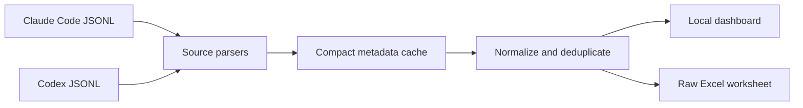

# Claude + Codex Usage Export

*English · [한국어](README.md)*

> Export local Claude Code and OpenAI Codex token history to one clean, filterable Excel workbook.


This project does one job: it turns the usage records already stored by Claude Code and Codex on your machine into an `.xlsx` file that can be inspected, sorted, shared, or analyzed elsewhere.

It is a local exporter, not a hosted analytics service. Conversation content is never included in the export or parse caches.

## What You Get

- Claude Code and Codex rows in the same dashboard and `Raw` worksheet
- A `Both` / `Claude Code` / `Codex` filter for separate dashboard views and exports
- A `Source` column that distinguishes where each record was found
- One-click `.xlsx` export plus a headless `curl` workflow
- Today, yesterday, last 24 hours, 7 days, 30 days, all history, and custom ranges
- Regular input, cache-write, cache-read, output, total tokens, and cost estimates
- Duplicate removal across active, transcript, and archived session copies
- File-level progress during first indexing
- Compact metadata-only disk caches for fast restarts
- Automated tests on both Ubuntu and macOS with Node.js 18 and 22

## Installation

Requirements:

- macOS or Linux
- Node.js 18 or newer
- Local history from Claude Code, Codex, or both

### Run immediately with npx

No clone or local installation is required:

```bash
npx --yes github:KimYeongHyeon/claude-codex-usage-export
```

Open [http://127.0.0.1:3456](http://127.0.0.1:3456) after the server starts. The first `npx` run downloads the project and its dependency from GitHub; subsequent runs may reuse the local npm cache.

Environment variables can be placed before the command:

```bash
PORT=8080 USAGE_EXPORT_USER=you@example.com \
  npx --yes github:KimYeongHyeon/claude-codex-usage-export
```

This form is convenient for one-off use. Clone the repository when you want a pinned checkout, offline reuse, or development access.

### Install from source

```bash
git clone https://github.com/KimYeongHyeon/claude-codex-usage-export.git
cd claude-codex-usage-export
npm ci
npm start
```

The server prefers [http://127.0.0.1:3456](http://127.0.0.1:3456). If that port is already occupied, it automatically tries the next port and prints the actual `Open:` URL in the terminal. By default, it only listens on the local machine.

## Usage

### Export from the dashboard

1. Start the exporter with the `npx` command above or with `npm start` from a clone.
2. Open [http://127.0.0.1:3456](http://127.0.0.1:3456).
3. Wait for the initial indexing progress to finish. The default load covers the last 30 days.
4. Select a preset or enter a custom start and end date.
5. Click a column header if the workbook should use a specific sort order.
6. Click **Download Excel**.

The downloaded workbook contains one `Raw` worksheet. Dashboard filters and sorting are applied to the exported rows.

| Control | Behavior |
| --- | --- |
| `Both` / `Claude Code` / `Codex` | Shows and exports both log sources or only the selected source |
| `Today` / `Yesterday` | Uses calendar-day boundaries in the browser's time zone |
| `Last 24h` | Uses a rolling 24-hour window |
| `Last 7d` / `Last 30d` | Uses rolling 7-day or 30-day windows |
| `All` | Scans all available local history |
| Custom range | Includes the selected start and end dates |
| Column header | Toggles ascending and descending export order |
| `Refresh` | Rescans changed files and reuses cached results for unchanged files |

Stop the server with `Ctrl+C` in the terminal where it is running.

### Run on a remote server

The recommended approach is an SSH tunnel. Start the exporter on the remote server, note the exact port printed after `Open:`, then run this on your computer:

```bash
ssh -N -L 45678:127.0.0.1:3456 user@example-server
```

Replace `3456` if the exporter selected another port, then open [http://127.0.0.1:45678](http://127.0.0.1:45678). This keeps the exporter bound to localhost and requires no public listener.

Remote-development environments such as VS Code port forwarding, JupyterHub, and path-based workspace proxies are also supported. Open the forwarded URL exactly as provided, including a prefix such as `/proxy/3456/`. Dashboard API calls and downloads preserve that prefix.

To expose the exporter directly on a trusted private network:

```bash
HOST=0.0.0.0 PORT=3456 \
  npx --yes github:KimYeongHyeon/claude-codex-usage-export
```

The terminal prints the available local and network URLs. The exporter has no built-in authentication; do not expose it directly to the public internet. Put authentication and TLS in front of it when using a reverse proxy, and forward the complete app path including `/api/*` and `/export.xlsx`.

### Export from the command line

The same workbook can be downloaded without opening a browser. Start the server, then call the export endpoint:


```bash
npm start &
curl --fail --output usage-raw.xlsx \
  'http://127.0.0.1:3456/export.xlsx?since=0&preset=all'
```

Common examples:

```bash
# Last 7 days
curl --fail --output usage-last-7d.xlsx \
  'http://127.0.0.1:3456/export.xlsx?preset=last7d'

# Everything since an ISO-8601 timestamp
curl --fail --output usage-since-date.xlsx \
  'http://127.0.0.1:3456/export.xlsx?since=2026-01-01T00:00:00Z&preset=all'

# Sort the complete export by total tokens, largest first
curl --fail --output usage-by-tokens.xlsx \
  'http://127.0.0.1:3456/export.xlsx?since=0&preset=all&sortBy=Total%20Tokens&sortDirection=desc'

# Export only Codex usage
curl --fail --output codex-usage.xlsx \
  'http://127.0.0.1:3456/export.xlsx?since=0&preset=all&source=codex'

# Export only Claude Code usage
curl --fail --output claude-usage.xlsx \
  'http://127.0.0.1:3456/export.xlsx?since=0&preset=all&source=claude'
```

### HTTP endpoints

| Endpoint | Description |
| --- | --- |
| `GET /` | Local dashboard |
| `GET /api/raw` | Normalized rows as JSON |
| `GET /api/progress` | Current indexing progress |
| `GET /export.xlsx` | Excel workbook download |

Supported export parameters:

| Parameter | Accepted values | Purpose |
| --- | --- | --- |
| `since` | Unix milliseconds or ISO-8601 timestamp | Limits the source scan; defaults to 30 days ago |
| `preset` | `today`, `yesterday`, `last24h`, `last7d`, `last30d`, `all` | Selects the export time window |
| `source` | `all`, `claude`, `codex` | Includes both log sources or only the selected source; defaults to `all` |
| `start`, `end` | Unix milliseconds or ISO-8601 timestamps | Defines an explicit range when both are present |
| `inclusiveEnd` | `true` or `false` | Controls whether an explicit end timestamp is included |
| `timeZone` | IANA name such as `Asia/Seoul` | Applies calendar-day presets in a specific time zone |
| `sortBy` | Any export column name | Selects the sort column |
| `sortDirection` | `asc` or `desc` | Selects the sort direction |

`start`, `end`, and `inclusiveEnd` must be provided together. An invalid explicit range falls back to the selected preset.
The legacy `provider` parameter remains accepted as an alias for `source` so older scripts do not break.

## Data Sources

The defaults follow the official local directory layouts:

```text
~/.claude/projects/**/*.jsonl
~/.claude/transcripts/**/*.jsonl
~/.codex/sessions/**/*.jsonl
~/.codex/archived_sessions/**/*.jsonl
```

Override the roots with `CLAUDE_CONFIG_DIR` and `CODEX_HOME` when your setup differs.

The default view reads the last 30 days. Selecting **All** expands the scan to the complete local history.

## Set the User Column

Use one shared label for both providers:

```bash
USAGE_EXPORT_USER=you@example.com npm start
```

Legacy provider-specific variables remain supported:

```bash
CLAUDE_USAGE_USER=you@example.com CODEX_USAGE_USER=you@example.com npm start
```

Claude Code metadata can sometimes provide an email automatically. Codex logs generally cannot, so an unset value may export as `unknown`.

## Export Schema

The workbook contains one row per token-usage event.

| Column | Meaning |
| --- | --- |
| `Date` | Event timestamp |
| `Source` | Log origin: `Claude Code` or `Codex` |
| `Model` | Model recorded for the event |
| `User` | Configured label, detected email, or `unknown` |
| `Cloud Agent ID` | Claude cloud-agent identifier when present |
| `Automation ID` | Claude automation identifier when present |
| `Kind` | Export category; currently `Included` |
| `Max Mode` | Whether Claude max mode can be inferred |
| `Input (w/ Cache Write)` | Tokens written to a prompt cache |
| `Input (w/o Cache Write)` | Direct input excluding cache reads and writes |
| `Cache Read` | Tokens read from a prompt cache |
| `Output Tokens` | Generated output tokens; Codex reasoning tokens are already included |
| `Total Tokens` | Source-reported input plus output |
| `Cost` | Estimated standard API-equivalent USD cost, when priced |

`Source` and `Model` answer different questions. `Source` tells you which local log contained the event; `Model` tells you which model actually ran. A GPT model can therefore legitimately appear with `Source = Claude Code` when a router, proxy, plugin, or delegated workflow records that call in Claude Code history.

Pricing is selected from the `Model` family, never from `Source`. GPT and o-series models use OpenAI rates even inside Claude Code logs; Claude models use Anthropic rates even inside Codex logs. Unknown or unpriced models produce a blank `Cost` instead of falling back to another vendor's price.

Upgrade note: the former `Provider` export column was renamed to `Source` because it represents the log origin, not the model vendor. Scripts that consume `/api/raw` or the workbook should update that column name. The `provider=` URL parameter remains available as a deprecated alias for `source=`.

## How It Works



The two sources are scanned concurrently. Each parser keeps only the identifiers and token metadata needed for normalization and deduplication. The browser dashboard and Excel exporter consume the same row model.

## Performance

Codex histories can span several gigabytes. The first index must read the relevant JSONL files once; that cold scan can take several seconds. Afterward, unchanged files are served from compact per-file caches and normal refreshes avoid reparsing and rewriting them.

The startup path never waits for the network pricing refresh: bundled prices are available immediately, the server begins listening on localhost, and the optional LiteLLM refresh happens in the background.

Cache files:

```text
~/.claude-usage-dashboard-cache.json
~/.claude-usage-dashboard-codex-cache.json
```

Both caches are written with owner-only permissions (`0600`) on macOS and Linux. Delete them at any time to force a clean re-index.
Their legacy filenames are intentionally retained so upgrades reuse an existing index instead of performing another cold scan.

## Privacy and Network Access

- The HTTP server binds to `127.0.0.1` by default. Setting `HOST` opts into another interface.
- Source JSONL files never leave your machine.
- Conversation text is not copied into the caches or export.
- Excel files are generated locally.
- One background `GET` request refreshes Claude model prices from LiteLLM.
- If that request fails or the machine is offline, bundled prices remain active.

The metadata caches still reveal timestamps, model names, token counts, and session identifiers. Treat them as private usage records.

## Cost Semantics

`Cost` is an estimate, not an invoice or subscription meter.

- Claude prices are refreshed from the [LiteLLM model price dataset](https://github.com/BerriAI/litellm/blob/main/model_prices_and_context_window.json), with bundled offline defaults.
- Codex uses [OpenAI's standard API token prices](https://developers.openai.com/api/docs/pricing) as an API-equivalent estimate.
- Price selection follows the recorded model family, not the log source.
- Cache reads are priced separately and are usually much cheaper than uncached input. More tokens can therefore produce a lower estimate when most of them are cache hits.
- Codex sessions authenticated through a ChatGPT plan are subscription usage; their actual billed cost cannot be derived from local logs. See [Codex authentication](https://developers.openai.com/codex/auth) and [Codex pricing](https://developers.openai.com/codex/pricing).
- Tool calls, containers, regional premiums, and Batch/Flex/Fast pricing are outside this export.

## Configuration

| Variable | Default | Purpose |
| --- | --- | --- |
| `PORT` | `3456` | Local HTTP port |
| `HOST` | `127.0.0.1` | Listen address; use `0.0.0.0` only for intentional network access |
| `USAGE_EXPORT_USER` | detected value or `unknown` | Shared `User` value |
| `CLAUDE_USAGE_USER` | unset | Claude-only fallback label |
| `CODEX_USAGE_USER` | unset | Codex-only fallback label |
| `CLAUDE_CONFIG_DIR` | `~/.claude` | Claude Code data root |
| `CODEX_HOME` | `~/.codex` | Codex data root |
| `LITELLM_PRICING_URL` | public LiteLLM JSON | Alternate Claude pricing URL |

Example:

```bash
PORT=8080 USAGE_EXPORT_USER=you@example.com \
  CLAUDE_CONFIG_DIR=/data/claude CODEX_HOME=/data/codex npm start
```

If the preferred `PORT` is occupied, the exporter advances to the next available port and reports the selected URL.

## Development

```bash
npm test
```

Project layout:

```text
src/parser.js         Claude Code discovery, normalization, and cache
src/codex-parser.js   Codex discovery, normalization, and cache
src/pricing.js        Model-aware price resolution
src/filter.js         Date-window filtering
src/sort.js           Stable column sorting
src/workbook.js       XLSX workbook generation
src/server.js         Local HTTP server and export endpoint
src/public/index.html Browser dashboard
test/                 Node test suite
```

## Troubleshooting

### No rows appear

Confirm that at least one source directory above contains `.jsonl` files. Then check custom roots and permissions. Only records with token-usage metadata can be exported.

### Port 3456 is already in use

No action is normally required. The exporter selects the next available port and prints the exact URL after `Open:`. You can still choose a preferred starting port with `PORT=8080`.

### The dashboard says it received HTML instead of JSON

Open the exact URL printed by the server or forwarding service, including any `/proxy/.../` prefix. If a reverse proxy is configured manually, make sure it forwards the dashboard, `/api/raw`, `/api/progress`, and `/export.xlsx` to the same exporter process. An HTML response from an API request usually means the proxy sent the request to a login page or fallback page instead.

### The browser console mentions `content-script-injectable.js`

That filename belongs to a browser extension content script, not this exporter. Disable extensions for the localhost page or open it in a clean browser profile if the extension error affects the page.

### First load is slow

Let the initial 30-day index finish before selecting **All**. A complete Codex history can be gigabytes. Later loads reuse the disk cache.

### Cost is blank

The model has no published standard API price or is unknown. Blank is intentional; inventing a price would be misleading.

### Pricing refresh fails

The app is fully usable offline with bundled prices. The warning only means the optional Claude price refresh failed.

## Scope

This is deliberately an export tool. It does not upload telemetry, read provider account quotas, reproduce official invoices, or reconstruct usage missing from local history.

## License

Released under the [MIT License](LICENSE).
