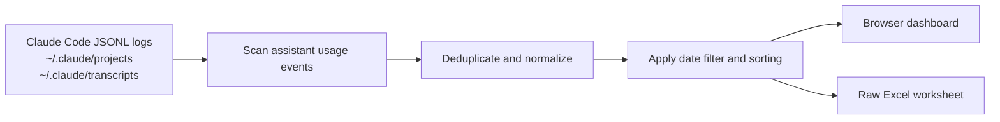

# Claude Usage Export

> Export your local Claude Code usage history to a clean, filterable Excel workbook.


Claude Usage Export has one focused purpose: turn the usage events already stored by Claude Code in `~/.claude/` into an Excel file you can inspect, sort, share, or analyze elsewhere.

It is a local web app, not a hosted analytics service. Your conversation logs stay on your machine.

## What You Get

- One-click `.xlsx` export with a single `Raw` worksheet
- Date presets for today, yesterday, the last 24 hours, 7 days, 30 days, or all history
- Custom start and end dates
- Sortable usage table with 100-row pagination
- Input, cache-write, cache-read, output, and total token counts
- Per-event cost estimates using current LiteLLM pricing when available
- Duplicate-event removal across Claude Code project and transcript logs
- Live progress during the first scan
- In-memory and persistent caching for fast refreshes and restarts

## Quick Start

Requirements:

- Node.js 18 or newer
- Claude Code usage history under `~/.claude/`

```bash
git clone https://github.com/KimYeongHyeon/claude-usage-dashboard.git
cd claude-usage-dashboard
npm install
npm start
```

Open [http://127.0.0.1:3456](http://127.0.0.1:3456), choose a date range, and click **Download Excel**.

The downloaded file is named `claude-usage-raw.xlsx`.

### Set the User column

Claude Code logs do not always contain an account email. Set `CLAUDE_USAGE_USER` when you want a consistent value in the exported `User` column:

```bash
CLAUDE_USAGE_USER=you@example.com npm start
```

Without this variable, the app uses an email found directly in the event metadata or exports `unknown`.

## Export Schema

The workbook contains one row per included assistant usage event.

| Column | Meaning |
| --- | --- |
| `Date` | Event timestamp from the Claude Code log |
| `User` | Configured user label, detected email, or `unknown` |
| `Cloud Agent ID` | Cloud agent identifier when present in the event |
| `Automation ID` | Automation identifier when present in the event |
| `Kind` | Export category; currently `Included` |
| `Model` | Model recorded for the event |
| `Max Mode` | Whether max mode can be inferred from event metadata |
| `Input (w/ Cache Write)` | Tokens written to the prompt cache |
| `Input (w/o Cache Write)` | Regular input tokens excluding cache writes |
| `Cache Read` | Tokens read from the prompt cache |
| `Output Tokens` | Generated output tokens |
| `Total Tokens` | Sum of input, cache-write, cache-read, and output tokens |
| `Cost` | Estimated USD cost for the event |

## How It Works



The server reads `assistant` events containing `message.usage`, removes duplicates using message and request identifiers, calculates normalized token fields, and serves the same row model to both the dashboard and the Excel exporter.

The default view loads the last 30 days. Selecting a wider range triggers an additional scan only when required.

## Privacy and Network Access

Your Claude Code logs are processed locally.

- The server binds to `127.0.0.1` by default.
- Log contents are not uploaded by this application.
- At startup, the app makes one outbound `GET` request to LiteLLM's public pricing JSON to refresh model prices.
- If that request fails, bundled fallback prices are used.
- Parsed usage events are cached locally at `~/.claude-usage-dashboard-cache.json` to speed up future starts.
- Excel files are generated locally and downloaded by your browser.

The cache contains normalized copies of usage events. Treat it with the same care as your Claude Code history.

## Cost Estimates

`Cost` is an estimate, not an Anthropic invoice or subscription-usage meter.

The app maps model names to Opus, Sonnet, and Haiku pricing categories and accounts separately for regular input, cache creation, cache reads, and output tokens. Prices are refreshed from the [LiteLLM model price dataset](https://github.com/BerriAI/litellm/blob/main/model_prices_and_context_window.json) at startup, with bundled defaults as an offline fallback.

Use the export for analysis and reconciliation, not as the sole source of truth for billing.

## Configuration

| Variable | Default | Purpose |
| --- | --- | --- |
| `PORT` | `3456` | Local HTTP port |
| `CLAUDE_USAGE_USER` | detected email or `unknown` | Value written to the `User` column |
| `LITELLM_PRICING_URL` | LiteLLM's public pricing JSON | Alternative pricing dataset URL |

Example:

```bash
PORT=8080 CLAUDE_USAGE_USER=you@example.com npm start
```

## Performance

The first scan can take time when `~/.claude/` contains thousands of session files. The dashboard reports file-level progress while it works.

Subsequent loads are faster because unchanged files are reused from an in-memory cache. The persistent cache also avoids reparsing unchanged files after a server restart. Table rendering is capped at 100 rows per page so a large export does not freeze the browser.

## Development

```bash
npm test
```

The project uses Node's built-in test runner. The test suite covers parsing, deduplication, date filtering, timezone boundaries, sorting, pricing categories, HTTP endpoints, and workbook export behavior.

Project layout:

```text
src/parser.js         Claude Code JSONL discovery and normalization
src/pricing.js        Model pricing resolution
src/filter.js         Date-window filtering
src/sort.js           Stable column sorting
src/workbook.js       XLSX workbook generation
src/server.js         Local HTTP server and export endpoint
src/public/index.html Browser dashboard
test/                 Node test suite
```

## Troubleshooting

### The dashboard shows no rows

Confirm that Claude Code has created JSONL history under `~/.claude/projects/` or `~/.claude/transcripts/`. Only assistant events containing `message.usage` can be exported.

### The first load is slow

Start with the default 30-day view and let the initial scan finish. Later refreshes and restarts reuse cached parses. Selecting **All** may require scanning substantially more history.

### Pricing refresh fails

The app continues with bundled fallback prices. Check network access if you need the latest LiteLLM values.

### The User column is `unknown`

Start the app with `CLAUDE_USAGE_USER=you@example.com npm start`. Local Claude Code events do not consistently include an account identity.

## Scope

This project is intentionally an export tool. It does not read Anthropic account quotas, replace the official billing console, upload telemetry, or attempt to reconstruct events missing from local Claude Code history.

## License

Released under the [MIT License](LICENSE).
