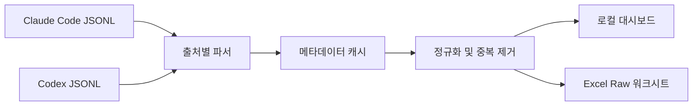

# Claude + Codex Usage Export

> 로컬에 저장된 Claude Code와 OpenAI Codex 사용량을 한 화면에서 확인하고, 필터링된 원본 데이터를 Excel로 내보내는 로컬 전용 도구입니다.


이 프로젝트의 목적은 명확합니다. Claude Code와 Codex가 사용자 컴퓨터에 남긴 로컬 사용 기록을 읽어, 검토·정렬·공유·후속 분석에 사용할 수 있는 `.xlsx` 파일로 변환합니다.

호스팅형 분석 서비스가 아닙니다. 원본 JSONL, 대화 내용, 사용량 데이터는 외부 서버로 업로드하지 않으며 대화 내용은 내보내기 파일과 파싱 캐시에도 포함하지 않습니다.

## 주요 기능

- Claude Code와 Codex 사용량을 하나의 대시보드와 `Raw` 워크시트로 통합
- `Both` / `Claude Code` / `Codex` 필터를 이용한 출처별 조회 및 내보내기
- 로그 출처를 명확히 구분하는 `Source` 컬럼
- 클릭 한 번으로 `.xlsx` 다운로드 또는 `curl`을 이용한 헤드리스 내보내기
- 오늘, 어제, 최근 24시간, 7일, 30일, 전체 기간 및 사용자 지정 기간 지원
- 일반 입력, 캐시 쓰기, 캐시 읽기, 출력, 전체 토큰 및 API 환산 비용 제공
- 활성 세션, transcript, 보관 세션 사이의 중복 기록 제거
- 최초 인덱싱 진행률 표시
- 메타데이터만 저장하는 디스크 캐시를 이용한 빠른 재시작
- Ubuntu 및 macOS, Node.js 18 및 22 자동 테스트

## 빠른 시작

### 요구 사항

- macOS 또는 Linux
- Node.js 18 이상
- Claude Code 또는 Codex의 로컬 사용 기록

### npx로 바로 실행

저장소를 복제하거나 별도로 설치할 필요가 없습니다.

```bash
npx --yes github:KimYeongHyeon/claude-codex-usage-export
```

서버가 시작되면 터미널에 다음과 같이 실제 접속 주소가 출력됩니다.

```text
Claude + Codex Usage Export is ready.
Open: http://127.0.0.1:3456
```

브라우저에서 출력된 `Open:` 주소를 여십시오. 기본 포트 `3456`이 이미 사용 중이면 `3457`, `3458` 순서로 사용 가능한 포트를 자동 선택합니다.

환경변수는 명령 앞에 지정할 수 있습니다.

```bash
PORT=8080 USAGE_EXPORT_USER=you@example.com \
  npx --yes github:KimYeongHyeon/claude-codex-usage-export
```

최초 `npx` 실행은 GitHub에서 프로젝트와 의존성을 내려받습니다. 이후 실행에서는 npm 로컬 캐시를 재사용할 수 있습니다.

### 소스에서 실행

```bash
git clone https://github.com/KimYeongHyeon/claude-codex-usage-export.git
cd claude-codex-usage-export
npm ci
npm start
```

서버는 기본적으로 `127.0.0.1`에만 바인딩되므로 같은 컴퓨터에서만 접근할 수 있습니다.

## 사용 방법

### 대시보드에서 Excel 내보내기

1. 위의 `npx` 명령 또는 `npm start`로 서버를 실행합니다.
2. 터미널에 표시된 `Open:` 주소를 브라우저에서 엽니다.
3. 최초 인덱싱이 끝날 때까지 기다립니다. 기본 조회 범위는 최근 30일입니다.
4. `Both`, `Claude Code`, `Codex` 중 내보낼 로그 출처를 선택합니다.
5. 기간 프리셋 또는 사용자 지정 시작일·종료일을 선택합니다.
6. 필요한 경우 컬럼 헤더를 눌러 정렬 순서를 지정합니다.
7. **Download Excel**을 누릅니다.

다운로드되는 통합 문서에는 `Raw` 워크시트 하나가 포함됩니다. 현재 적용된 기간, 출처 및 정렬 조건이 Excel에도 그대로 반영됩니다.

| 화면 제어 | 동작 |
| --- | --- |
| `Both` / `Claude Code` / `Codex` | 전체 또는 선택한 로그 출처만 조회하고 내보냅니다. |
| `Today` / `Yesterday` | 브라우저 시간대의 날짜 경계를 사용합니다. |
| `Last 24h` | 현재 시각을 기준으로 직전 24시간을 조회합니다. |
| `Last 7d` / `Last 30d` | 현재 시각을 기준으로 직전 7일 또는 30일을 조회합니다. |
| `All` | 사용 가능한 전체 로컬 기록을 탐색합니다. |
| `Custom range` | 선택한 시작일과 종료일을 포함하는 기간을 조회합니다. |
| 컬럼 헤더 | 오름차순과 내림차순을 전환합니다. |
| `Refresh` | 변경된 파일을 다시 읽고, 변경되지 않은 파일은 캐시를 재사용합니다. |

서버를 종료하려면 실행 중인 터미널에서 `Ctrl+C`를 누르십시오.

### 원격 서버에서 실행

가장 안전한 방식은 SSH 터널입니다. 원격 서버에서 도구를 실행하고 터미널에 출력된 포트를 확인한 다음, 로컬 컴퓨터에서 다음 명령을 실행합니다.

```bash
ssh -N -L 45678:127.0.0.1:3456 user@example-server
```

도구가 다른 포트를 선택했다면 마지막 `3456`을 실제 포트로 바꾸십시오. 이후 로컬 브라우저에서 [http://127.0.0.1:45678](http://127.0.0.1:45678)을 열면 됩니다.

VS Code 포트 포워딩, JupyterHub, 경로 기반 워크스페이스 프록시도 지원합니다. `/proxy/3456/`처럼 접두사가 포함된 주소가 제공되면 그 주소 전체를 그대로 열어야 합니다. 대시보드의 API 호출과 다운로드 주소도 동일한 접두사를 유지합니다.

신뢰할 수 있는 사설망에 직접 공개하려면 다음과 같이 실행할 수 있습니다.

```bash
HOST=0.0.0.0 PORT=3456 \
  npx --yes github:KimYeongHyeon/claude-codex-usage-export
```

이 도구에는 인증 기능이 없습니다. 인터넷에 직접 공개하지 마십시오. 역방향 프록시를 사용할 때는 인증과 TLS를 구성하고 `/api/*`, `/export.xlsx`를 포함한 전체 애플리케이션 경로를 전달해야 합니다.

### 명령줄에서 Excel 내보내기

브라우저 없이도 동일한 통합 문서를 받을 수 있습니다.

```bash
npm start &
curl --fail --output usage-raw.xlsx \
  'http://127.0.0.1:3456/export.xlsx?since=0&preset=all'
```

자주 사용하는 예시는 다음과 같습니다.

```bash
# 최근 7일
curl --fail --output usage-last-7d.xlsx \
  'http://127.0.0.1:3456/export.xlsx?preset=last7d'

# 지정 시각 이후의 모든 사용량
curl --fail --output usage-since-date.xlsx \
  'http://127.0.0.1:3456/export.xlsx?since=2026-01-01T00:00:00Z&preset=all'

# 전체 사용량을 Total Tokens 내림차순으로 정렬
curl --fail --output usage-by-tokens.xlsx \
  'http://127.0.0.1:3456/export.xlsx?since=0&preset=all&sortBy=Total%20Tokens&sortDirection=desc'

# Codex 사용량만 내보내기
curl --fail --output codex-usage.xlsx \
  'http://127.0.0.1:3456/export.xlsx?since=0&preset=all&source=codex'

# Claude Code 사용량만 내보내기
curl --fail --output claude-usage.xlsx \
  'http://127.0.0.1:3456/export.xlsx?since=0&preset=all&source=claude'
```

## HTTP API

### 엔드포인트

| 엔드포인트 | 설명 |
| --- | --- |
| `GET /` | 로컬 대시보드 |
| `GET /api/raw` | 정규화된 사용량 행을 JSON으로 반환 |
| `GET /api/progress` | 현재 인덱싱 진행률 반환 |
| `GET /export.xlsx` | Excel 통합 문서 다운로드 |

### 내보내기 파라미터

| 파라미터 | 허용값 | 설명 |
| --- | --- | --- |
| `since` | Unix 밀리초 또는 ISO 8601 시각 | 원본 탐색 범위를 제한합니다. 기본값은 30일 전입니다. |
| `preset` | `today`, `yesterday`, `last24h`, `last7d`, `last30d`, `all` | 내보낼 기간을 선택합니다. |
| `source` | `all`, `claude`, `codex` | 전체 또는 특정 로그 출처를 선택합니다. 기본값은 `all`입니다. |
| `start`, `end` | Unix 밀리초 또는 ISO 8601 시각 | 두 값이 모두 있을 때 명시적인 기간을 정의합니다. |
| `inclusiveEnd` | `true`, `false` | 명시적인 종료 시각을 포함할지 결정합니다. |
| `timeZone` | `Asia/Seoul` 등의 IANA 시간대 | 날짜 기반 프리셋에 적용할 시간대를 지정합니다. |
| `sortBy` | 내보내기 컬럼명 | 정렬할 컬럼을 지정합니다. |
| `sortDirection` | `asc`, `desc` | 정렬 방향을 지정합니다. |

`start`, `end`, `inclusiveEnd`는 함께 제공해야 합니다. 값이 잘못되었거나 시작일이 종료일보다 늦으면 선택한 `preset`을 사용합니다.

이전 버전과의 호환을 위해 `provider` 파라미터도 `source`의 별칭으로 계속 허용합니다.

## 사용량 데이터 출처

사용량은 Anthropic 또는 OpenAI의 계정 API에서 가져오지 않습니다. 현재 컴퓨터에 저장된 다음 JSONL 파일을 직접 읽습니다.

```text
~/.claude/projects/**/*.jsonl
~/.claude/transcripts/**/*.jsonl
~/.codex/sessions/**/*.jsonl
~/.codex/archived_sessions/**/*.jsonl
```

다른 위치를 사용한다면 `CLAUDE_CONFIG_DIR`과 `CODEX_HOME`으로 루트 경로를 변경할 수 있습니다.

### Claude Code

`type`이 `assistant`이고 `message.usage`가 있는 이벤트에서 다음 값을 읽습니다.

```text
message.usage.input_tokens
message.usage.cache_creation_input_tokens
message.usage.cache_read_input_tokens
message.usage.output_tokens
```

`message.id`, `requestId`, 세션 ID 및 토큰 메타데이터를 이용해 `projects`와 `transcripts` 사이의 중복 기록을 제거합니다.

### Codex

다음 형태의 토큰 이벤트를 읽습니다.

```text
type = event_msg
payload.type = token_count
payload.info.last_token_usage
```

주요 사용량 필드는 다음과 같습니다.

```text
input_tokens
cached_input_tokens
output_tokens
reasoning_output_tokens
total_tokens
```

각 행은 누적값인 `total_token_usage`가 아니라 개별 호출의 `last_token_usage`로 생성합니다. Codex의 reasoning 토큰은 `output_tokens`에 이미 포함되므로 다시 더하지 않습니다.

Codex 로그는 일반적으로 캐시 생성 토큰을 별도 필드로 제공하지 않습니다. 따라서 Codex의 `Input (w/ Cache Write)`가 `0`이어도 캐시가 사용되지 않았다는 뜻은 아닙니다. 실제 캐시 적중량은 `Cache Read`에서 확인하십시오.

## 사용자 컬럼 설정

두 로그 출처에 공통 사용자명을 지정하려면 다음 환경변수를 사용합니다.

```bash
USAGE_EXPORT_USER=you@example.com npm start
```

이전 버전의 출처별 환경변수도 지원합니다.

```bash
CLAUDE_USAGE_USER=you@example.com CODEX_USAGE_USER=you@example.com npm start
```

Claude Code 로그에서는 이메일을 자동으로 찾을 수 있지만 Codex 로그에는 사용자 정보가 없는 경우가 많습니다. 사용자명을 설정하지 못하면 `unknown`으로 표시합니다.

## 내보내기 스키마

Excel에는 토큰 사용 이벤트 하나당 한 행이 생성됩니다.

| 컬럼 | 의미 |
| --- | --- |
| `Date` | 이벤트 발생 시각 |
| `Source` | 로그 출처: `Claude Code` 또는 `Codex` |
| `Model` | 이벤트에 기록된 실제 모델명 |
| `User` | 설정값, 로그에서 찾은 이메일 또는 `unknown` |
| `Cloud Agent ID` | Claude cloud agent 식별자 |
| `Automation ID` | Claude automation 식별자 |
| `Kind` | 내보내기 분류. 현재 값은 `Included`입니다. |
| `Max Mode` | Claude max mode 추론 결과 |
| `Input (w/ Cache Write)` | 프롬프트 캐시에 새로 기록된 토큰 |
| `Input (w/o Cache Write)` | 캐시 읽기와 쓰기를 제외한 직접 입력 토큰 |
| `Cache Read` | 프롬프트 캐시에서 읽은 토큰 |
| `Output Tokens` | 생성된 출력 토큰. Codex reasoning 토큰도 포함됩니다. |
| `Total Tokens` | 로그에 기록된 입력과 출력의 합계 |
| `Cost` | 표준 API 가격으로 환산한 USD 추정 비용 |

### `Source`와 `Model`의 차이

두 컬럼은 서로 다른 정보를 나타냅니다.

- `Source`: 어느 로컬 로그에서 발견한 이벤트인지 표시합니다.
- `Model`: 실제 호출에 기록된 모델을 표시합니다.

라우터, 프록시, 플러그인 또는 위임 작업이 GPT 호출을 Claude Code 기록에 남기면 `Source = Claude Code`, `Model = gpt-*`가 함께 나타날 수 있습니다. 이는 모순이 아닙니다.

가격은 `Source`가 아니라 `Model` 계열을 기준으로 선택합니다. Claude Code 로그 안의 GPT/o-series 모델에는 OpenAI 가격을, Codex 로그 안의 Claude 모델에는 Anthropic 가격을 적용합니다. 알 수 없거나 공식 가격이 없는 모델은 다른 모델 가격으로 추정하지 않고 `Cost`를 비워 둡니다.

이전 버전의 `Provider` 컬럼은 실제 의미를 정확히 반영하기 위해 `Source`로 변경했습니다. `/api/raw` 또는 Excel을 처리하는 기존 스크립트는 컬럼명을 갱신해야 합니다.

## 처리 구조



Claude와 Codex 파서는 동시에 실행됩니다. 각 파서는 정규화와 중복 제거에 필요한 식별자 및 토큰 메타데이터만 유지합니다. 브라우저 대시보드와 Excel 내보내기는 동일한 정규화 행을 사용합니다.

## 성능과 캐시

Codex 기록은 수 GB까지 커질 수 있습니다. 최초 인덱싱에서는 관련 JSONL 파일을 한 번 읽어야 하므로 수 초 이상 걸릴 수 있습니다. 이후에는 파일별 수정 시각 캐시를 이용해 변경되지 않은 파일의 파싱과 캐시 재작성을 건너뜁니다.

서버 시작은 네트워크 가격 갱신을 기다리지 않습니다. 내장 가격표로 즉시 서버를 열고, 선택적인 LiteLLM 가격 갱신은 백그라운드에서 수행합니다.

캐시 파일은 다음과 같습니다.

```text
~/.claude-usage-dashboard-cache.json
~/.claude-usage-dashboard-codex-cache.json
```

두 파일은 macOS와 Linux에서 소유자만 읽고 쓸 수 있는 `0600` 권한으로 저장됩니다. 언제든 삭제해 전체 재인덱싱을 수행할 수 있습니다.

프로젝트명이 변경되기 전 생성한 캐시를 그대로 재사용하기 위해 기존 캐시 파일명을 의도적으로 유지합니다.

## 비용의 의미

화면과 Excel의 `Cost`는 **실제 청구액이나 구독 사용료가 아니라 표준 API 가격 환산 추정치**입니다.

- Claude 가격은 [LiteLLM 모델 가격 데이터](https://github.com/BerriAI/litellm/blob/main/model_prices_and_context_window.json)에서 백그라운드로 갱신하며 오프라인용 기본값도 내장합니다.
- Codex 가격은 [OpenAI 표준 API 가격](https://developers.openai.com/api/docs/pricing)을 이용해 환산합니다.
- 가격표는 로그 출처가 아닌 기록된 모델 계열로 선택합니다.
- 캐시 읽기는 일반 입력보다 훨씬 저렴할 수 있습니다. 토큰이 더 많아도 캐시 적중 비중이 높으면 비용 추정치가 더 낮게 나올 수 있습니다.
- ChatGPT 플랜으로 로그인한 Codex 사용량은 구독 사용량입니다. 로컬 로그만으로 실제 청구액을 계산할 수 없습니다. 자세한 내용은 [Codex 인증](https://developers.openai.com/codex/auth)과 [Codex 가격](https://developers.openai.com/codex/pricing)을 참고하십시오.
- 도구 호출, 컨테이너, 지역별 추가 요금 및 Batch/Flex/Fast 가격은 계산 범위에 포함하지 않습니다.

## 개인정보 보호와 네트워크

- 기본 HTTP 서버는 `127.0.0.1`에만 바인딩됩니다.
- 원본 JSONL은 사용자 컴퓨터 밖으로 전송되지 않습니다.
- 대화 내용은 캐시와 Excel에 복사하지 않습니다.
- Excel 파일은 로컬에서 생성합니다.
- Claude 모델 가격 갱신을 위한 백그라운드 `GET` 요청 한 번만 수행합니다.
- 네트워크 요청이 실패해도 내장 가격표로 모든 기능을 사용할 수 있습니다.

메타데이터 캐시에는 시각, 모델명, 토큰 수 및 세션 식별자가 포함됩니다. 캐시 파일도 개인 사용 기록으로 취급하십시오.

## 환경변수

| 변수 | 기본값 | 설명 |
| --- | --- | --- |
| `PORT` | `3456` | 우선 사용할 HTTP 포트 |
| `HOST` | `127.0.0.1` | 서버 바인딩 주소. 의도적인 네트워크 공개에만 `0.0.0.0`을 사용하십시오. |
| `USAGE_EXPORT_USER` | 자동 감지 또는 `unknown` | 두 로그 출처에 공통으로 사용할 `User` 값 |
| `CLAUDE_USAGE_USER` | 미설정 | Claude Code 전용 사용자명 대체값 |
| `CODEX_USAGE_USER` | 미설정 | Codex 전용 사용자명 대체값 |
| `CLAUDE_CONFIG_DIR` | `~/.claude` | Claude Code 데이터 루트 |
| `CODEX_HOME` | `~/.codex` | Codex 데이터 루트 |
| `LITELLM_PRICING_URL` | 공개 LiteLLM JSON | Claude 가격을 읽을 대체 URL |

예시:

```bash
PORT=8080 USAGE_EXPORT_USER=you@example.com \
  CLAUDE_CONFIG_DIR=/data/claude CODEX_HOME=/data/codex npm start
```

지정한 `PORT`가 이미 사용 중이면 다음 포트를 자동으로 선택하고 실제 주소를 터미널에 출력합니다.

## 개발 및 검증

```bash
npm test
```

프로젝트 구성:

```text
src/parser.js         Claude Code 탐색, 정규화 및 캐시
src/codex-parser.js   Codex 탐색, 정규화 및 캐시
src/pricing.js        모델별 가격 판별
src/filter.js         기간 및 출처 필터링
src/sort.js           안정적인 컬럼 정렬
src/workbook.js       XLSX 통합 문서 생성
src/server.js         로컬 HTTP 서버 및 내보내기 API
src/public/index.html 브라우저 대시보드
test/                 Node.js 자동 테스트
```

## 문제 해결

### 데이터가 표시되지 않음

위의 데이터 경로 중 하나에 `.jsonl` 파일이 있는지 확인하십시오. 사용자 지정 루트와 파일 읽기 권한도 확인해야 합니다. 토큰 사용량 메타데이터가 있는 이벤트만 표시됩니다.

### 기본 포트가 이미 사용 중임

별도 조치가 필요하지 않습니다. 사용 가능한 다음 포트를 자동으로 선택하고 정확한 `Open:` 주소를 출력합니다. 시작 포트를 직접 지정하려면 `PORT=8080`처럼 실행하십시오.

### 대시보드에서 JSON 대신 HTML을 받았다는 오류가 발생함

터미널 또는 포트 포워딩 서비스가 제공한 주소를 `/proxy/.../` 접두사까지 포함하여 그대로 여십시오. 역방향 프록시를 직접 설정했다면 대시보드, `/api/raw`, `/api/progress`, `/export.xlsx`가 모두 같은 프로세스로 전달되는지 확인하십시오.

API 요청에서 HTML이 반환되면 프록시가 로그인 화면이나 기본 페이지를 대신 보냈을 가능성이 큽니다.

### 브라우저 콘솔에 `content-script-injectable.js` 오류가 표시됨

이 파일은 브라우저 확장 프로그램이 주입한 스크립트이며 본 프로젝트 코드가 아닙니다. 오류가 화면 동작에 영향을 준다면 localhost 페이지에서 확장 프로그램을 끄거나 깨끗한 브라우저 프로필을 사용하십시오.

### 최초 로딩이 느림

기본 최근 30일 인덱싱이 끝난 뒤 `All`을 선택하십시오. 전체 Codex 기록은 수 GB일 수 있습니다. 다음 실행부터는 디스크 캐시를 재사용합니다.

### 비용이 비어 있음

기록된 모델을 알 수 없거나 공개된 표준 API 가격이 없는 경우입니다. 잘못된 가격을 임의로 적용하지 않기 위해 의도적으로 비워 둡니다.

### 가격표 갱신이 실패함

오프라인용 가격표가 내장되어 있으므로 모든 기능을 계속 사용할 수 있습니다. 경고는 선택적인 최신 Claude 가격 갱신에 실패했다는 뜻입니다.

## 지원 범위

이 프로젝트는 로컬 사용 기록을 Excel로 내보내는 도구입니다. 다음 기능은 제공하지 않습니다.

- 사용량 또는 텔레메트리 외부 업로드
- 공급자 계정의 공식 할당량 조회
- 공식 청구서 재현
- 로컬 기록에 존재하지 않는 사용량 복구

## 라이선스

[MIT License](LICENSE)로 배포합니다.
